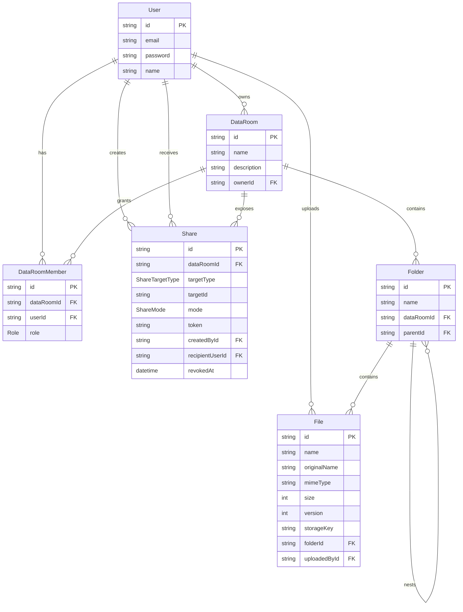

# Data Room MVP

Full-stack virtual data room MVP for secure due-diligence document sharing.

## Stack

- Frontend: React, TypeScript, Vite, Tailwind, shadcn-style Button primitive
- Backend: NestJS, PostgreSQL, Prisma
- Auth: email/password with JWT
- Storage: local filesystem in development and a persistent Railway Volume in production

For production, the `FilesService` storage boundary can be swapped for S3, Supabase Storage, or Vercel Blob without changing the data model.

## Features

- Email/password authentication
- Owner-scoped data rooms
- Member roles: `OWNER`, `EDITOR`, `VIEWER`
- Nested folders with breadcrumbs
- Folder create, rename, delete with subtree impact warning
- Multi-file upload with drag-and-drop and per-file progress
- PDF and image validation
- File preview, download, rename, move, delete
- Name conflict resolution inside folders
- Public read-only share links for data rooms, folders, and files
- Permissioned read-only shares for specific users
- Share revoke flow
- Light/dark theme

## Setup

### Backend

```bash
cd backend
npm install
cp .env.example .env # or create .env manually
npx prisma generate
npx prisma db push
npm run start:dev
```

Required backend env:

```bash
DATABASE_URL="postgresql://..."
DIRECT_URL="postgresql://..."
JWT_SECRET="replace-me"
PORT=3000
FRONTEND_URL="http://localhost:5173"
CORS_ORIGINS="http://localhost:5173,http://127.0.0.1:5173"
UPLOADS_DIR="./uploads"
```

### Frontend

```bash
cd frontend
npm install
npm run dev
```

Frontend env:

```bash
VITE_API_URL="http://127.0.0.1:3000"
```

## ERD



## Design Decisions

- Data room membership is the main authorization boundary. Owners manage members and shares; editors manage content; viewers read only.
- Folders use an adjacency-list model with `parentId`, which is simple for MVP CRUD and can be optimized later with materialized paths or closure tables.
- Shares are polymorphic by `targetType + targetId`, allowing a single sharing flow for data rooms, folders, and files.
- File display names are unique per folder. Conflicts are resolved by appending ` (2)`, ` (3)`, etc. The original upload name remains stored for auditability.
- Upload storage is isolated behind service methods and records a `storageKey`, which keeps the database portable across storage providers.

## How It Scales

### Folder total size and item count

For the MVP, folder subtree counts are computed by collecting descendant folder IDs and aggregating matching files. At larger scale this should move to one of:

- cached counters on `Folder` updated transactionally on file/folder writes;
- materialized path or closure table for efficient subtree queries;
- background recalculation jobs for repair and analytics.

### One data room with 100,000 files

The current tree endpoint is convenient for small rooms. At 100,000 files it should become paginated and lazy:

- load folders and files separately;
- paginate files by `folderId, createdAt, id`;
- add cursor pagination for folder/file listings;
- keep indexes on `Folder(dataRoomId, parentId)`, `File(folderId, name)`, `File(uploadedById)`, and `Share(targetType, targetId)`;
- avoid returning the whole tree on every folder click.

### Extending sharing to viewer/editor roles

The current `Share` model can be extended with a `role` column using the existing `Role` enum or a dedicated `ShareRole` enum. Because shares already reference `targetType`, `targetId`, and optionally `recipientUserId`, per-user viewer/editor permissions can be added without remodeling the core `DataRoomMember`, `Folder`, or `File` tables.

## AI Usage

AI assistance was used to speed up implementation, UX iteration, test planning, and documentation drafting. The final architecture, validation passes, and local testing were reviewed and adjusted in the project codebase.

## Deployment

The repository contains deployment configuration for Vercel and Railway.

### Backend on Railway

1. Create an empty Railway project and add a PostgreSQL service.
2. Add a backend service from this GitHub repository.
3. Set **Root Directory** to `/backend`.
4. Set **Config File Path** to `/backend/railway.json`.
5. Add a Railway Volume to the backend service with mount path `/app/uploads`.
6. Generate a public domain for the backend service.
7. Add the variables below and deploy.

```bash
NODE_ENV="production"
DATABASE_URL="${{Postgres.DATABASE_URL}}"
JWT_SECRET="replace-with-a-random-secret-at-least-32-characters"
FRONTEND_URL="https://your-project.vercel.app"
```

Optional Google OAuth variables:

```bash
GOOGLE_CLIENT_ID="..."
GOOGLE_CLIENT_SECRET="..."
GOOGLE_CALLBACK_URL="https://your-backend.up.railway.app/auth/google/callback"
```

Railway automatically provides `PORT` and `RAILWAY_VOLUME_MOUNT_PATH`. The
deploy config builds Nest, runs `prisma migrate deploy`, starts the compiled
application, and checks `/health` before activating the deployment.

For a new Railway database, use the committed Prisma migrations. If an existing
database was previously created with `prisma db push`, baseline it before using
`prisma migrate deploy` instead of running both workflows against the same data.

### Frontend on Vercel

1. Import this GitHub repository as a Vercel project.
2. Set **Root Directory** to `frontend`.
3. Keep the detected Vite build settings; `frontend/vercel.json` supplies the
   SPA rewrite and output directory.
4. Add this environment variable for Production and Preview deployments:

```bash
VITE_API_URL="https://your-backend.up.railway.app"
```

5. Deploy, then copy the final Vercel URL into Railway's `FRONTEND_URL` and
   redeploy the backend so production CORS and the OAuth redirect are correct.

When Google OAuth is enabled, add the Railway callback URL to Google Cloud's
authorized redirect URIs. Swagger is available at `/api/docs` on the Railway
domain and the deployment health endpoint is `/health`.
